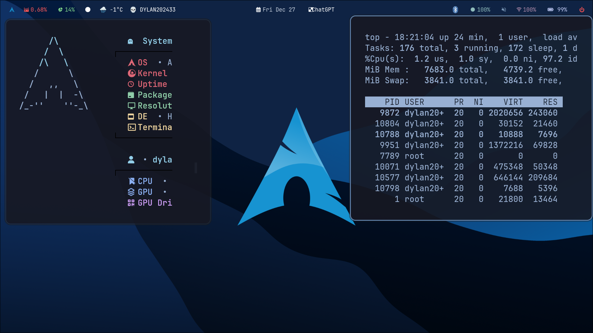

First of all, Install the newest Hyprland using this guide depend on your Distro:

yay -S hyprland-git

Base setups 💻:

yay -S waybar rofi dunst kitty swaylock-fancy-git swayidle pamixer light brillo cmake meson cpio pkg-config waypaper hyprpolkitagent 

sudo pacman -S python python-pip waybar cliphist swww  power-profiles-daemon python-pywal

Required Plugin

hyprpm update

hyprpm add https://github.com/alexhulbert/Hyprchroma

hyprpm enable hyprchroma

hyprpm reload

Required Fonts

https://github.com/ryanoasis/nerd-fonts/releases/download/v2.2.2/JetBrainsMono.zip

https://github.com/ryanoasis/nerd-fonts/releases/download/v2.3.3/Iosevka.zip

yay -S ttf-font-awesome

Once you download them and unpack them, place them into ~/.fonts or ~/.local/share/fonts.

Then run this command for your system to detect the newly installed fonts.

fc-cache -fv

Copy Files 💾

git clone https://github.com/dylan202433/dylan202433-s-dotfile.git

cd dylan202433-s-dotfile

cp -r ./config/* ~/.config/

if there some error please fix it
